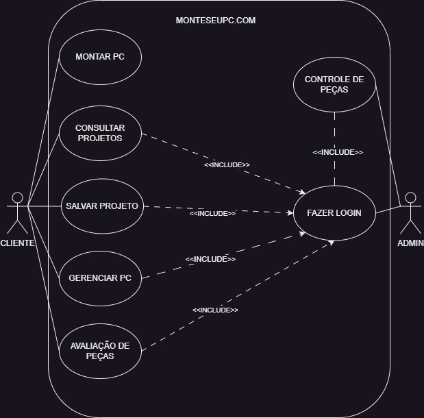

# Monte seu pc

Projeto das matérias DCA0205 - PROJETO E ENGENHARIA DE SOFTWARE e 
DCA0207 - BANCO DE DADOS - T01 (2023.2).

### Sites de referência:
* Agregadores:
    - https://meupc.net/build <-- esse aqui acaba sendo muito próx. da ideia
* Comércios:
    - https://www.kabum.com.br/monte-seu-pc
    - https://www.pichau.com.br/build
    - https://www.terabyteshop.com.br/pc-gamer/full-custom
    - https://chipart.dooca.store/monte-seu-computador
    - https://www.studiopc.com.br/monte-seu-computador  

### Diagrama de caso de uso:

```mermaid
erDiagram;
    USUARIO ||..|{ COMPUTADOR : MONTA;
    USUARIO{;
        LOGIN login;
        bool ehADMIN;
    };
    COMPUTADOR }o--o{ PECAS : POSSUI;
    COMPUTADOR{;
        int id;
        string nome;
        LOGIN dono;
    };
    PECAS }o--o{ PECAS : INCOMPATIBILIDADE;
    PECAS{;
        string nome;
        string marca;
        string[] propriedades;
    };
```